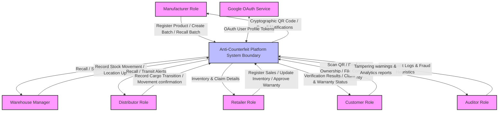
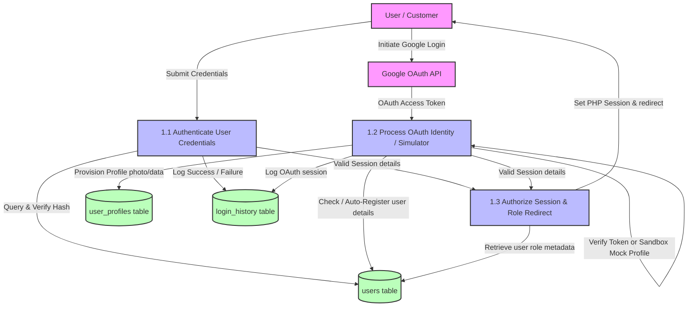

# Data Flow Diagrams - Anti-Counterfeit Enterprise Platform

This document describes the flow of information across the **Anti-Counterfeit Enterprise Platform**. It includes a Level 0 Context Diagram to outline system boundaries and Level 1 Diagrams detailing specific enterprise workflows, database mappings, and cryptographic mechanisms.

---

## 🎭 External Entities & Role Matrix
The platform enforces a rigid role-based access matrix:
- **Manufacturer**: Registers brands, creates batches, generates secure QR codes, and initiates product recalls.
- **Warehouse Manager**: Manages storage facilities, and logs inbound/outbound stock transfers.
- **Distributor**: Handles logistics and tracks cargo transitions.
- **Retailer**: Sells products, records purchases, and reviews warranty claims.
- **Customer**: Scans QR codes for verification, claims product ownership, files complaints, and processes warranty requests.
- **Auditor**: Reviews system analytics, inspects audit logs, and validates hash chains for database tampering.
- **Super Admin**: Audits system workflows, manages companies, and oversees global configuration.
- **Google OAuth Service**: Authenticates users and retrieves identity profiles.

---

## 🗺️ Level 0 DFD: Context Diagram
The Level 0 diagram shows the overall system boundary, external entities, and high-level data flows into and out of the Anti-Counterfeit Platform.



---

## 🔑 Level 1 DFD: Authentication & Session Management
This flow handles standard credential logins, local Google Auth Simulation (sandbox), and real Google OAuth sign-in.

* **Primary Logic**: [auth/login.php](file:///c:/xampp/htdocs/Anti-counterfeit-System/auth/login.php) & [auth/google-login.php](file:///c:/xampp/htdocs/Anti-counterfeit-System/auth/google-login.php)
* **Affected Tables**: `users`, `user_profiles`, `login_history`



---

## 📦 Level 1 DFD: Product Registration & Cryptographic QR Generation
When a manufacturer registers products, the system secures the identity using private-key signatures and generates QR codes containing verified payload configurations.

* **Primary Functions**: `product_secure_hash()`, `digital_signature()`, and `qr_payload()` in [includes/enterprise.php](file:///c:/xampp/htdocs/Anti-counterfeit-System/includes/enterprise.php)
* **Register Controller**: [products/register_product.php](file:///c:/xampp/htdocs/Anti-counterfeit-System/products/register_product.php)
* **Affected Tables**: `products`, `qr_codes`, `product_batches`, `inventory`, `product_history`, `audit_logs`

```mermaid
graph TD
    classDef external fill:#f9f,stroke:#333,stroke-width:2px;
    classDef process fill:#bbf,stroke:#333,stroke-width:2px;
    classDef datastore fill:#bfb,stroke:#333,stroke-width:2px;

    %% External Entities
    Manufacturer["Manufacturer"]:::external
    SecretKey[["APP_SECRET_KEY"]]:::external

    %% Processes
    P2_1["2.1 Create Production Batch"]:::process
    P2_2["2.2 Register Product Metadata"]:::process
    P2_3["2.3 Calculate Hashes & Signatures"]:::process
    P2_4["2.5 Seed Initial Inventory"]:::process

    %% Datastores
    DB_Batches[("product_batches table")]:::datastore
    DB_Products[("products table")]:::datastore
    DB_QRs[("qr_codes table")]:::datastore
    DB_Inv[("inventory table")]:::datastore
    DB_History[("product_history table")]:::datastore
    DB_Audit[("audit_logs table")]:::datastore

    %% Flows
    Manufacturer -->|Batch details| P2_1
    P2_1 -->|Save details & status| DB_Batches

    Manufacturer -->|Product Name, Batch, Expiry| P2_2
    P2_2 -->|Generate PRD-YYYY-xxxx code| P2_3
    
    SecretKey -->|Concatenate with code & timestamp| P2_3
    P2_3 -->|1. Hash: SHA256<br>2. Signature: HMAC-SHA256| P2_3
    
    P2_3 -->|Write secure product hash & signature| DB_Products
    P2_3 -->|Write payload: code, timestamp, hash, signature| DB_QRs
    P2_3 -->|Log lifecycle stage: Manufactured| DB_History
    P2_3 -->|Trigger Inventory Creation| P2_4
    P2_4 -->|Insert stock line (Quantity = 1)| DB_Inv
    P2_4 -->|Append Chained Audit Entry| DB_Audit
    
    P2_3 -->|Render QR payload / Download option| Manufacturer
```

---

## 🚚 Level 1 DFD: Supply Chain Movements & Logistics
Maintains trace records of inventory stock allocations and transit handoffs from manufacturing to retail.

* **Primary Logic**: [operations/supply_chain.php](file:///c:/xampp/htdocs/Anti-counterfeit-System/operations/supply_chain.php) & [operations/inventory.php](file:///c:/xampp/htdocs/Anti-counterfeit-System/operations/inventory.php)
* **Affected Tables**: `inventory`, `inventory_movements`, `product_history`, `products`, `audit_logs`

```mermaid
graph TD
    classDef external fill:#f9f,stroke:#333,stroke-width:2px;
    classDef process fill:#bbf,stroke:#333,stroke-width:2px;
    classDef datastore fill:#bfb,stroke:#333,stroke-width:2px;

    %% External Entities
    Actor["Supply Chain Actor<br>(Manufacturer/Warehouse/Distributor/Retailer)"]:::external

    %% Processes
    P3_1["3.1 Log Stock Transfer / Movement"]:::process
    P3_2["3.2 Acknowledge / Confirm Delivery"]:::process
    P3_3["3.3 Recalculate Stock Allocations"]:::process

    %% Datastores
    DB_Movements[("inventory_movements table")]:::datastore
    DB_Inv[("inventory table")]:::datastore
    DB_History[("product_history table")]:::datastore
    DB_Products[("products table")]:::datastore
    DB_Audit[("audit_logs table")]:::datastore

    %% Flows
    Actor -->|Record movement: stage, notes, source/target| P3_1
    P3_1 -->|Insert movement entry (Acknowledged = NULL)| DB_Movements
    P3_1 -->|Update product lifecycle_status| DB_Products
    P3_1 -->|Log history stage| DB_History

    Actor -->|Scan incoming product code| P3_2
    P3_2 -->|Acknowledge transfer & set receiver_user_id| DB_Movements
    P3_2 -->|Trigger inventory update| P3_3
    
    P3_3 -->|Subtract quantity from sender location| DB_Inv
    P3_3 -->|Add quantity to receiver location| DB_Inv
    
    P3_2 -->|Append Chained Audit Entry| DB_Audit
```

---

## 🛡️ Level 1 DFD: Product Verification & Algorithmic Fraud Telemetry
When a QR code or code string is submitted, the system checks signature parameters and executes geographic/velocity analysis to detect counterfeiting attempts.

* **Primary Functions**: `parse_qr_or_code()`, `assess_fraud()`, and `create_notification()` in [includes/enterprise.php](file:///c:/xampp/htdocs/Anti-counterfeit-System/includes/enterprise.php)
* **Verify Controller**: [verification/verify.php](file:///c:/xampp/htdocs/Anti-counterfeit-System/verification/verify.php)
* **Affected Tables**: `products`, `product_verifications`, `suspicious_verifications`, `fraud_logs`, `notifications`, `audit_logs`, `customer_purchases`, `ownership`

```mermaid
graph TD
    classDef external fill:#f9f,stroke:#333,stroke-width:2px;
    classDef process fill:#bbf,stroke:#333,stroke-width:2px;
    classDef datastore fill:#bfb,stroke:#333,stroke-width:2px;

    %% External Entities
    Scanner["User Scanning QR / Code<br>(Customer / Retailer)"]:::external
    SecretKey[["APP_SECRET_KEY"]]:::external
    NotificationFeed["Admin & Manufacturer Dashboard Alerts"]:::external

    %% Processes
    P4_1["4.1 Parse Scan Input & Query"]:::process
    P4_2["4.2 Cryptographically Validate Payload"]:::process
    P4_3["4.3 Run Heuristic Fraud Telemetry"]:::process
    P4_4["4.4 Assess Final Status & Flags"]:::process
    P4_5["4.5 Complete Purchase & Set Warranty"]:::process

    %% Datastores
    DB_Products[("products table")]:::datastore
    DB_Verifications[("product_verifications table")]:::datastore
    DB_Suspicious[("suspicious_verifications table")]:::datastore
    DB_FraudLogs[("fraud_logs table")]:::datastore
    DB_Notif[("notifications table")]:::datastore
    DB_Audit[("audit_logs table")]:::datastore
    DB_Purchases[("customer_purchases table")]:::datastore
    DB_Ownership[("ownership table")]:::datastore

    %% Flows
    Scanner -->|Send QR Payload, IP, User-Agent, Lat/Long, City/State/Country| P4_1
    P4_1 -->|Lookup Product by code| DB_Products

    %% Branch: Product Not Found
    P4_1 -->|Product Code NOT Found| DB_Suspicious
    P4_1 -->|Trigger Alerts (Score=65, Level=Medium)| P4_3

    %% Branch: Product Found
    P4_1 -->|Product Code Found| P4_2
    SecretKey -->|Recompute signature & compare| P4_2

    P4_2 -->|Pass Crypto Check (Boolean)| P4_3
    DB_Verifications -->|Get last 24h scan counts & 30m city movement hops| P4_3
    
    P4_3 -->|Evaluate Heuristics: Velocity (+35), Geo-hop (+40), IP Flood (+25)| P4_3
    P4_3 -->|Return Risk Score & Reasons| P4_4
    
    P4_4 -->|Status: Genuine / Invalid QR / Already Sold / Counterfeit| P4_4
    P4_4 -->|Insert verification log| DB_Verifications
    P4_4 -->|Log Chained Audit Entry| DB_Audit

    %% Risk / Counterfeit Triggers
    P4_4 -->|If Risk Level = High or QR Invalid: Update flagged=1| DB_Products
    P4_4 -->|If Risk Level = High or QR Invalid: Record Incident| DB_FraudLogs
    P4_4 -->|If Risk Level = High or QR Invalid: Generate Alerts| DB_Notif
    DB_Notif -->|Display notification feed| NotificationFeed
    
    %% Genuine customer branch
    P4_4 -->|If Genuine & Client = Customer: Trigger Auto-Purchase| P4_5
    P4_5 -->|Create customer transaction record| DB_Purchases
    P4_5 -->|Create ownership registry line| DB_Ownership
    P4_5 -->|Set product status = Verified, record warranty period| DB_Products
    
    P4_4 -->|Return verification outcome & status page| Scanner
```

---

## 📜 Level 1 DFD: Ownership Registration, Warranties, & Complaints
Tracks customer purchase registrations, warranty workflows, and counterfeit complaints.

* **Primary Pages**: [customers/ownership.php](file:///c:/xampp/htdocs/Anti-counterfeit-System/customers/ownership.php), [customers/warranty.php](file:///c:/xampp/htdocs/Anti-counterfeit-System/customers/warranty.php), & [customers/complaint.php](file:///c:/xampp/htdocs/Anti-counterfeit-System/customers/complaint.php)
* **Affected Tables**: `ownership`, `ownership_transfers`, `customer_purchases`, `warranty_claims`, `complaints`, `products`

```mermaid
graph TD
    classDef external fill:#f9f,stroke:#333,stroke-width:2px;
    classDef process fill:#bbf,stroke:#333,stroke-width:2px;
    classDef datastore fill:#bfb,stroke:#333,stroke-width:2px;

    %% External Entities
    Customer["Customer"]:::external
    Retailer["Retailer"]:::external
    Manufacturer["Manufacturer"]:::external

    %% Processes
    P5_1["5.1 Perform Ownership Verification / Transfer"]:::process
    P5_2["5.2 Submit & Approve Warranty Claim"]:::process
    P5_3["5.3 Log & Resolve Complaint"]:::process

    %% Datastores
    DB_Purchases[("customer_purchases table")]:::datastore
    DB_Ownership[("ownership table")]:::datastore
    DB_Transfers[("ownership_transfers table")]:::datastore
    DB_Claims[("warranty_claims table")]:::datastore
    DB_Complaints[("complaints table")]:::datastore
    DB_Products[("products table")]:::datastore

    %% Flows
    Customer -->|Input Invoice and Product code| P5_1
    P5_1 -->|Insert/Verify purchase| DB_Purchases
    P5_1 -->|Set ownership status to active| DB_Ownership
    
    Customer -->|Submit Ownership Transfer request| P5_1
    P5_1 -->|Insert ownership transfer log| DB_Transfers
    P5_1 -->|Update ownership status to transferred| DB_Ownership

    Customer -->|Initiate Warranty Claim with Invoice receipt| P5_2
    P5_2 -->|Insert claim record (Pending status)| DB_Claims
    Retailer -->|Set retailer_approved = 1| P5_2
    Manufacturer -->|Set manufacturer_approved = 1| P5_2
    P5_2 -->|Set claim_status = completed / approved| DB_Claims

    Customer -->|Report counterfeit: name, seller, upload receipt/image| P5_3
    P5_3 -->|Insert complaint (status = open)| DB_Complaints
    Manufacturer -->|Provide reply & update status| P5_3
    P5_3 -->|Save reply & close status| DB_Complaints
```

---

## 🔗 Level 1 DFD: Hash-Chained Audit Trail Integrity
To prevent direct database tampering of transaction histories, audit logs are cryptographically chained in chronological sequence.

* **Primary Logic**: `audit_log()` in [includes/enterprise.php](file:///c:/xampp/htdocs/Anti-counterfeit-System/includes/enterprise.php) & [reports/audit.php](file:///c:/xampp/htdocs/Anti-counterfeit-System/reports/audit.php)
* **Affected Tables**: `audit_logs`, `notifications`

```mermaid
graph TD
    classDef external fill:#f9f,stroke:#333,stroke-width:2px;
    classDef process fill:#bbf,stroke:#333,stroke-width:2px;
    classDef datastore fill:#bfb,stroke:#333,stroke-width:2px;

    %% External Entities
    SystemEvent["System Event Trigger<br>(Product register, movement log, verify)"]:::external
    Auditor["Auditor User"]:::external

    %% Processes
    P6_1["6.1 Chain and Log Audit Event"]:::process
    P6_2["6.2 Verify Hash Chain Validity"]:::process

    %% Datastores
    DB_Audit[("audit_logs table")]:::datastore
    DB_Notif[("notifications table")]:::datastore

    %% Flows
    SystemEvent -->|Trigger audit event: entity_type, statuses, details| P6_1
    DB_Audit -->|Retrieve record_hash of latest log entry| P6_1
    P6_1 -->|Concatenate record attributes + latest hash + timestamp| P6_1
    P6_1 -->|Calculate current record_hash (SHA256)| P6_1
    P6_1 -->|Insert new row (previous_record_hash = latest hash)| DB_Audit

    Auditor -->|Access Auditor Dashboard| P6_2
    DB_Audit -->|Fetch all logs ordered by ID ascending| P6_2
    P6_2 -->|Verify loop: current previous_record_hash == previous record_hash| P6_2
    
    %% Failure trigger
    P6_2 -->|If Mismatch Found: Trigger Alert| DB_Notif
    DB_Notif -->|Warn Auditor of tampered audit logs| Auditor
    
    P6_2 -->|If Verified: Display green health status| Auditor
```
