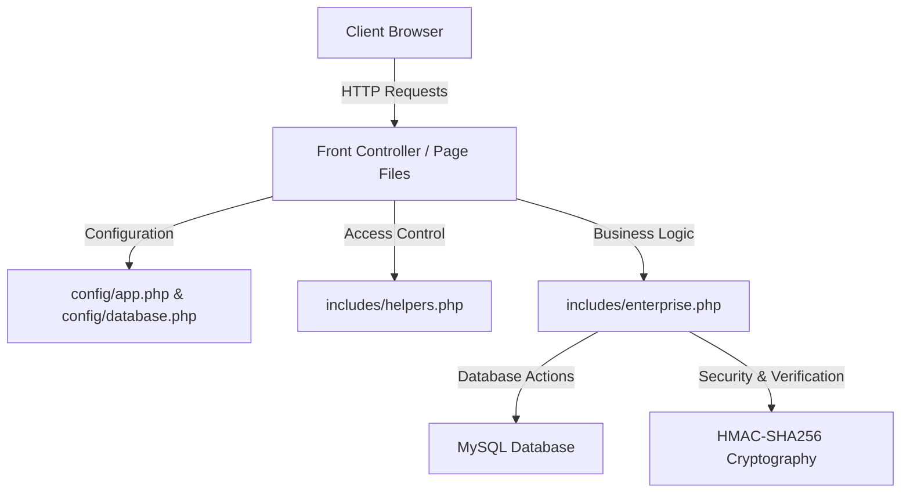
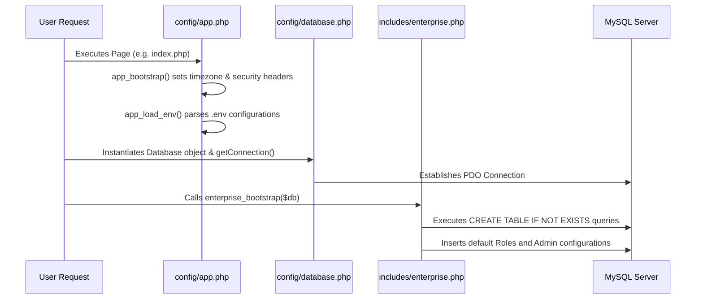
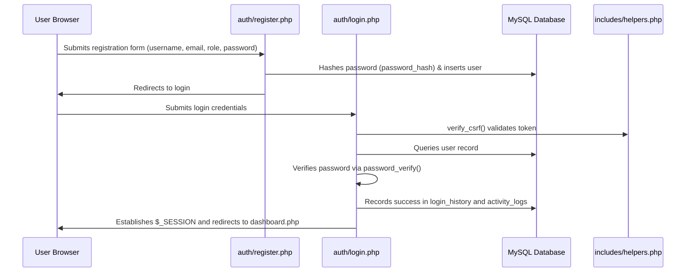
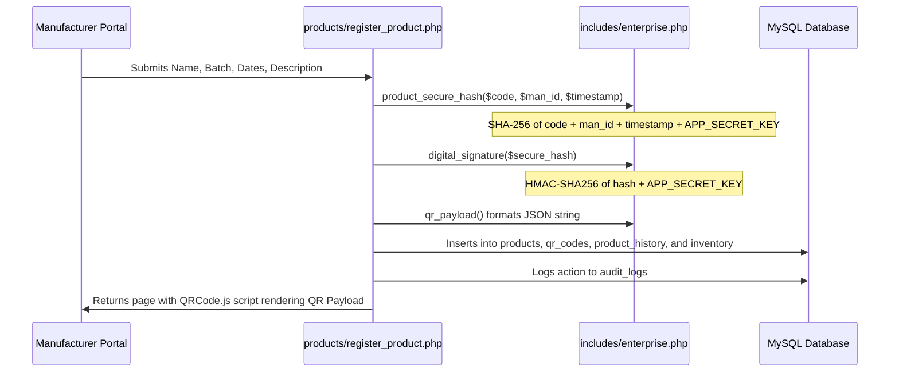
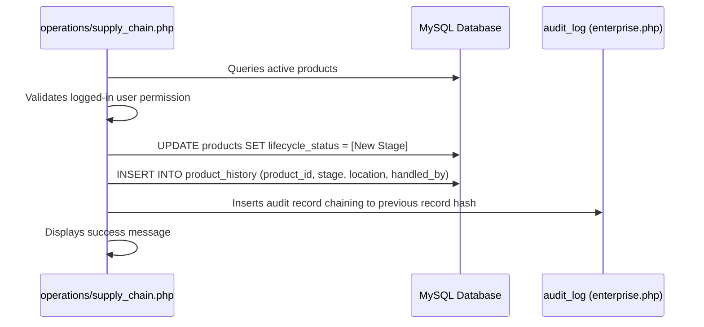
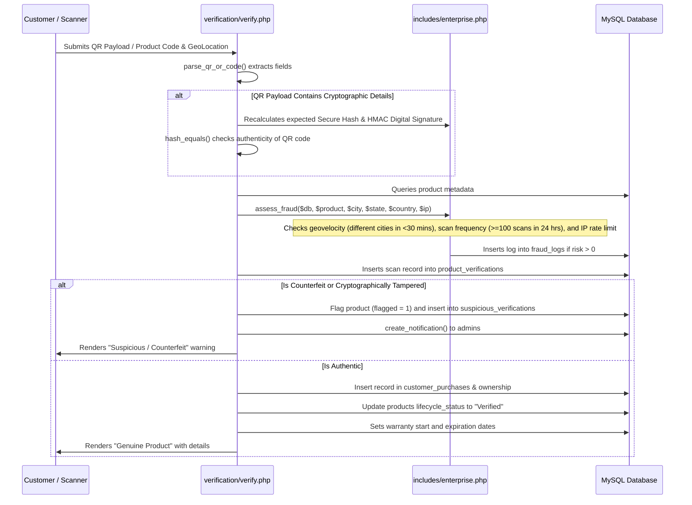

# Anti-Counterfeit Enterprise Platform - Complete System Architecture & Flow Guide

This document provides a detailed, comprehensive reference guide for the **Anti-Counterfeit Enterprise Platform**. It explains the system design, the database schema, security features, sequential program flows, and a file-by-file walkthrough. You can use this guide for interview preparation or public documentation.

---

## 1. System Architecture Overview

The system is built on a modular, role-based multi-tier architecture using **PHP (Backend)**, **MySQL (Database)**, **Vanilla CSS & JavaScript (Frontend)**, and **Cryptographic Verification (HMAC-SHA256)**.

### Architectural Core Concepts:
1. **Role-Based Access Control (RBAC)**: Supports roles including `super_admin`, `manufacturer`, `distributor`, `warehouse_manager`, `retailer`, `customer`, and `auditor`. Access rules are enforced via a centralized matrix in `includes/helpers.php`.
2. **Cryptographic Trust**: QR code payloads are cryptographically signed using HMAC-SHA256 signature chaining. This prevents QR spoofing and code generation by unauthorized third parties.
3. **Automated Fraud Diagnostics**: Scan endpoints assess threat risk dynamically by evaluating scan frequency, geovelocity, IP addresses, and database matching.
4. **Immutable Audit Trails**: Actions generate audit records that are cryptographically chained to the previous record hash.
5. **Runtime Bootstrapping**: DB tables and schema modifications are initialized dynamically at runtime upon the first database query.

---

## 2. Database Schema & Data Model

The database schema is split into three phases (`database.sql`, `enterprise_schema.sql`, and `phase2_schema.sql`) to expand functionality.

### Core Entities:
- **`users` & `user_profiles`**: Store user credentials, role definitions, and profile metadata (GST registration, company associations, language preferences).
- **`manufacturers` & `companies`**: Represent business entities producing items.
- **`products` & `product_batches`**: Track items registered by manufacturers.
- **`qr_codes`**: Link products to cryptographically generated payloads.
- **`product_verifications` & `suspicious_verifications`**: Logs of all product verification checks.
- **`fraud_logs`**: Captured telemetry detailing flagged counterfeit scans.
- **`inventory` & `inventory_movements`**: Real-time warehouse custody and stock movement logs.
- **`ownership` & `ownership_transfers`**: Tracking consumer purchases and transfers of ownership.
- **`warranty_claims`**: Claims filed by consumers and reviewed by retailers/manufacturers.
- **`product_recalls`**: Batch-wide recall commands issued by manufacturers.
- **`workflow_requests`**: Approval chains for transfers, claims, and registrations.
- **`audit_logs` & `activity_logs`**: Global system logs and chained audit records.

---

## 3. Configuration & Bootstrapping Flow

Before any user request is fulfilled, the application automatically boots configuration settings and verifies DB structures.

---

## 4. Sequential Execution Flows

### Flow A: User Registration & Authentication

---

### Flow B: Product Registration & QR Generation
Manufacturers register products and generate traceable QR labels.

---

### Flow C: Supply Chain Custody Transfer
Products are moved between manufacturers, warehouses, distributors, and retailers.

---

### Flow D: Product Verification & Fraud Prevention
A customer scans a QR code or enters a serial number. The system performs cryptographic, recall, and contextual fraud analysis.

---

### Flow E: Ownership Management & Claims
Registered users transfer ownership to other accounts or submit warranty claims.

1. **Ownership Transfer Request**:
   - Customer requests transfer inside `customers/ownership.php`.
   - Insert a record into `workflow_requests` with type `ownership_transfer` and status `pending`.
   - The workflow must be approved by the recipient or admin via `admin/workflows.php`.
   - Once approved, the database updates the status in `ownership` to `transferred` and registers the new customer.

2. **Warranty Claim**:
   - Customers request claims under `customers/warranty.php`.
   - An entry is inserted into `warranty_claims` with status `pending`.
   - Retailers review and approve/reject claims, setting `retailer_approved = 1`.
   - Manufacturers review and give final approval, setting `manufacturer_approved = 1` and status to `completed`.

---

## 5. Detailed File-by-File Breakdown

### Root Directory
| File Path | Description | Key Inputs | Core Logic | Key Outputs / Redirects |
| :--- | :--- | :--- | :--- | :--- |
| `index.php` | Public landing page for the application. | Session states | Renders public hero UI, feature cards, and direct links. | Links to `login.php` or `dashboard.php`. |

### Config Files (`config/`)
| File Path | Description | Key Inputs | Core Logic | Key Outputs / Redirects |
| :--- | :--- | :--- | :--- | :--- |
| `config/app.php` | Configures global settings and environments. | `.env` file | Reads variables, sets timezones, security headers, logging. | Configuration array and helper functions (`app_env`, `app_config`). |
| `config/database.php` | Configures and returns the PDO database instance. | App settings | Sets PDO parameters (timeout, error mode, charset). | Database connection instance (`conn`). |

### Shared Includes (`includes/`)
| File Path | Description | Key Inputs | Core Logic | Key Outputs / Redirects |
| :--- | :--- | :--- | :--- | :--- |
| `includes/helpers.php` | Global routing, session validation, and permissions. | Session role | Enforces access constraints, defines page paths, CSRF utility. | `require_login()`, `csrf_field()`, `page_url()`. |
| `includes/enterprise.php` | Business rules, security functions, database bootstrap. | DB resource | Handles DDL schemas, fraud analysis, hashing, signatures, notifications, and auditing. | `assess_fraud()`, `audit_log()`, `product_secure_hash()`. |
| `includes/header.php` | Common layout header and navigation sidebar. | Session role | Controls navigation visibility depending on user authorizations. | Renders layout header and sidebar HTML. |
| `includes/footer.php` | Common layout footer. | UI layouts | Closes tags, registers global scripts. | Renders footer HTML. |

### Auth Module (`auth/`)
| File Path | Description | Key Inputs | Core Logic | Key Outputs / Redirects |
| :--- | :--- | :--- | :--- | :--- |
| `auth/register.php` | User account registration. | POST values | Hashes password and records the user in the database. | Redirects to `login.php`. |
| `auth/login.php` | User authentication entry point. | POST values | Runs validation, updates login histories and session variables. | Redirects to `dashboard.php`. |
| `auth/logout.php` | Destroys session. | Session | Calls session destroy commands. | Redirects to `index.php`. |
| `auth/google-login.php` | Handles OAuth flows. | Request tokens | Simulates or processes OAuth exchanges. | Sets session and redirects to dashboard. |

### Dashboard & Account Modules (`dashboard/`, `account/`)
| File Path | Description | Key Inputs | Core Logic | Key Outputs / Redirects |
| :--- | :--- | :--- | :--- | :--- |
| `dashboard/dashboard.php` | Dynamic role-based landing portal. | Session details | Queries database stats and renders relevant links. | Navigation to operational subpages. |
| `account/profile.php` | User profile and activity overview. | User ID | Displays login history logs and user settings. | Updates `user_profiles` schema. |

### Operations Module (`operations/`)
| File Path | Description | Key Inputs | Core Logic | Key Outputs / Redirects |
| :--- | :--- | :--- | :--- | :--- |
| `operations/inventory.php` | Stock levels and threshold controls. | Location info | Tracks inventory quantities, alerts when below safety limits. | Manages warehouse stocks. |
| `operations/supply_chain.php` | Handover custody tracking page. | POST states | Records state-to-state logistics custody transitions. | Updates lifecycle stages in database. |

### Product Module (`products/`)
| File Path | Description | Key Inputs | Core Logic | Key Outputs / Redirects |
| :--- | :--- | :--- | :--- | :--- |
| `products/register_product.php` | Product identity generator page. | Post parameters | Cryptographically signs identity payloads and outputs QRs. | Creates products and renders QR labels. |
| `products/products.php` | Interactive catalog listing. | DB records | Queries active products matching manufacturer constraints. | Admin lists of items. |
| `products/edit_product.php` | Updates registered item fields. | ID values | Edits metadata, logs updates to change history tables. | Refreshes products catalog. |
| `products/batches.php` | Batch manufacturing control page. | Batch fields | Registers manufacturing lots with quality reports. | Populates `product_batches` schema. |
| `products/recalls.php` | Recall campaigns console. | Recall fields | Deploys recall alerts and marks matches as recalled. | Warns verifying customers of recalls. |

### Customer Module (`customers/`)
| File Path | Description | Key Inputs | Core Logic | Key Outputs / Redirects |
| :--- | :--- | :--- | :--- | :--- |
| `customers/ownership.php` | Registers purchase records. | Invoice details | Matches invoice and logs active consumer links. | Connects user to product profiles. |
| `customers/timeline.php` | Lifecycle histories for items. | Product code | Renders vertical chronological tracking graphs of movements. | Display maps of product lifecycle paths. |
| `customers/warranty.php` | Warranty claims portal. | Claim details | Files claims, updates retailer & manufacturer approvals. | Updates `warranty_claims` schemas. |
| `customers/complaint.php` | Customer ticketing system. | File attachments | Saves invoice images and files tracking tickets. | Records suspicious seller reports. |

### Verification Module (`verification/`)
| File Path | Description | Key Inputs | Core Logic | Key Outputs / Redirects |
| :--- | :--- | :--- | :--- | :--- |
| `verification/verify.php` | Interactive scanner page. | Scanned input | Performs integrity calculations and runs geovelocity checks. | Identifies authentic vs counterfeit products. |

### Admin Control Modules (`admin/`)
| File Path | Description | Key Inputs | Core Logic | Key Outputs / Redirects |
| :--- | :--- | :--- | :--- | :--- |
| `admin/companies.php` | Enlists company approvals. | ID selections | Manages approval status (approve/reject/suspend). | Updates `companies` table. |
| `admin/workflows.php` | Manages workflow approvals. | Request IDs | Processes approvals for transfers, claims, and registrations. | Completes workflows and updates states. |
| `admin/notifications.php` | Alerts notifications dashboard. | User context | Lists notifications for warnings, claims, and alerts. | Marks alerts as read. |
| `admin/system_health.php` | Server metric monitoring. | Global environments | Checks database status, PHP versions, disk space, and table counts. | System metrics page. |

### Reports & Communication Modules (`reports/`, `communication/`, `api/`)
| File Path | Description | Key Inputs | Core Logic | Key Outputs / Redirects |
| :--- | :--- | :--- | :--- | :--- |
| `reports/reports.php` | Reports dashboard. | Request contexts | Shows report options (counterfeits, inventory, etc.). | Navigation to exports. |
| `reports/business_reports.php` | Reports generator page. | Filter parameters | Compiles audit logs and scan histories to download formats. | Downloads CSV exports. |
| `reports/analytics.php` | Graphical analytics dashboards. | Metric sets | Aggregates fraud and verification stats. | Visual charts. |
| `reports/audit.php` | Secure cryptographic audit logs. | Logs table | Lists blockchain-like audit trails, verifying hash chains. | Displays audit trails. |
| `reports/global_search.php` | Universal global search. | Text input | Queries products, users, batches, and complaints. | Multi-column search results. |
| `communication/messages.php` | Peer-to-peer message workspace. | Chat text | Stores chat records between authorized roles. | Inbox layouts. |
| `api/api.php` | External API integrations. | Bearer tokens | Handles external product checks and updates. | JSON payloads. |
| `api/health.php` | System check endpoint. | Network test | Validates framework connections. | JSON status. |
